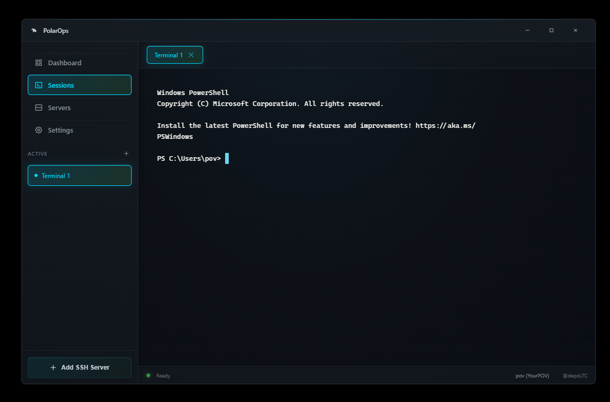
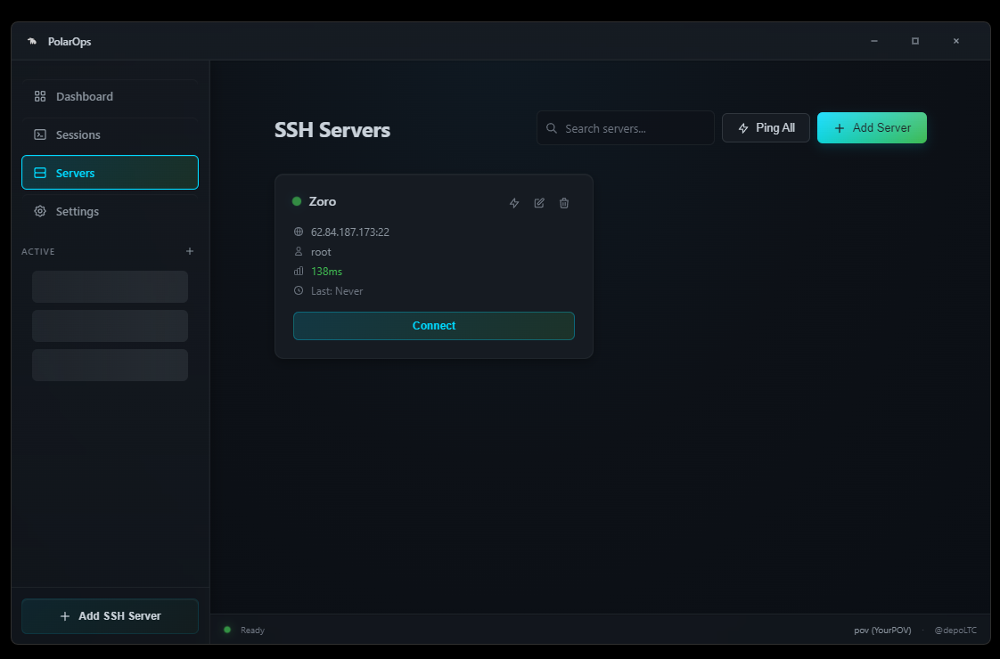
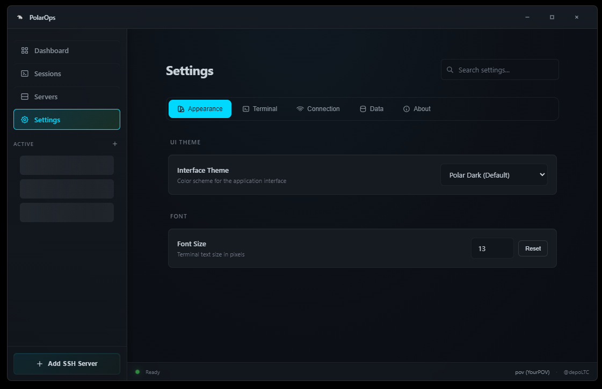

<div align="center" id="top">

# Polar Ops

</div>
<p align="center">
  
  
  
  
</p>

---

SSH terminal & server manager for Windows. Built with Electron.


## What is this

A desktop app for managing SSH connections and local terminals. think of it like a simpler MobaXterm or Termius but open source and lightweight

i've been working on this for about a month now (12/15/25). it's still in beta but it's usable.

## Features

- Multi-tab terminals (local + SSH)
- Server management with folders
- Theme support (7 themes so far)
- Session logging
- Broadcast mode (send commands to multiple terminals)
- SFTP browser
- Port forwarding
- SSH key management
- Right-click paste, Ctrl+V paste, copy on select
- Draggable tabs

## Stack

- Electron 28
- xterm.js
- node-pty
- ssh2

## Install

```bash
git clone https://github.com/yourpov/PolarOps.git
cd PolarOps
npm install
npm run dev
```

## Build

```bash
npm run build
```

Output goes to `dist/`

## Screenshots








## Known Issues

- GPU cache warnings on dev (goes away when packaged)
- Some themes need terminal restart to fully apply

## Roadmap

- [ ] Connection groups/tags
- [ ] Import/export settings
- [ ] Snippets manager
- [ ] Multi-monitor support

## Contact

- Telegram: [@depoLTC](https://github.com/depoLTC)
- GitHub: [@yourpov](https://github.com/yourpov)
- Instagram: [@capalot.ecstasy](https://instagram.com/capalot.ecstasy)

## License

MIT
